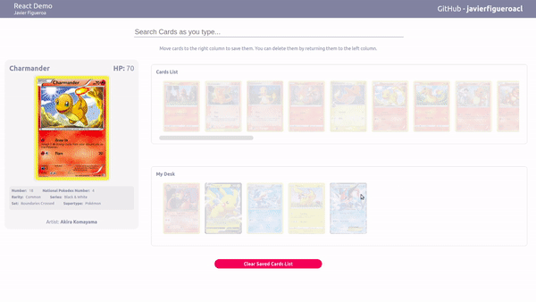
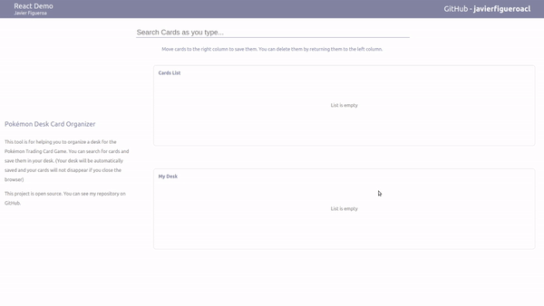
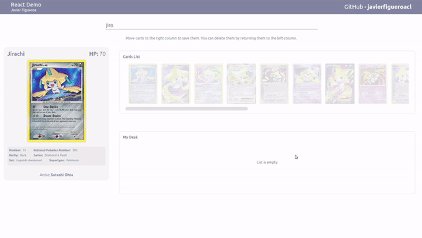

# Pokémon Desk Card Organizer

This tool is for helping you to organize a desk for the Pokémon Trading Card Game. Search for cards and drag & drop them into your desk. The deck is saved even if you reload the page.

## Table of contents

- [Getting Started](#general-info)
- [Technologies](#technologies)
- [Usage](#usage)
- [Future Work](#future-work)

## Getting Started

### Prerequisites

- NodeJS (including npm)

Close or download this repository. After that, using the terminal, run the following command in the project's folder to run the application.

### `npm start`

Runs the app in the development mode. 
Open [http://localhost:3000](http://localhost:3000) to view it in the browser.

## Technologies

- ReactJS
- Styled Components
- Redux (\*)

For styling, I decided to use style components because it allows to reuse the whole component including the styling, and being able to use Javascript into the CSS reduces considerably the number of "classes" required and makes the styling more readable and integrated to the component logic.

(\*) Main branch is using ContextAPI for the card state management, as their logic is fairly simple. To see the Redux implementation, go to the [redux-store](https://github.com/javierfigueroacl/pokemon-desk-organizer/tree/redux-store) branch.

## Usage

- Searching for a card

Search as you type in the input field. A list of matching results will be displayed.

- Saving the card

Drag a card from the Card List and drop it to your Desk to save it.

- Reordering the list

You can reorder the cards in both Card List and Desk. All cards including their order persist if you refresh the page.

## Changelog

### 2023.09.20

- Use Context / useReducer instead of Redux

## Future Work

These are some of the features that are in the works for this demo project:

- Use of mock data if API data fails: Currently I am using a public API to show this demo. However I do not know if that API will still be available in the future. I will add mock data in case the API is shut down in the future so this demo can still be used.
- Limit the number of cards that can the added to a desk and show "cards added / total cards" in the desk's list.
- Filter by type of card. These filters will be seen in the card info as well.
- Update dependencies: The dependencies are a little bit outdated. Since this project is used as portfolio, I will update to use the latest React and ES features. This is an ongoing work.
